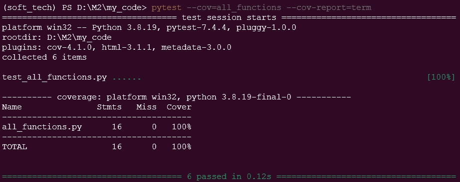
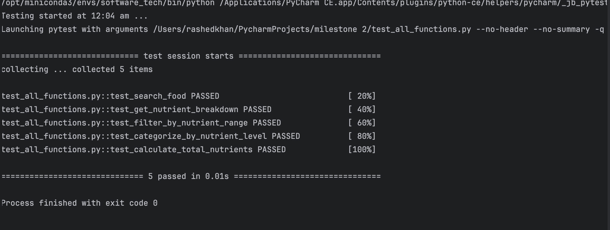

# Coverage Testing Report

Please provide your GitHub repository link.
### GitHub Repository URL: https://github.com/XXXX/XXXXX.git

---

The testing report should focus solely on <span style="color:red"> testing all the self-defined functions related to 
the five required features.</span> There is no need to test the GUI components. Therefore, it is essential to decouple your code and separate the logic from the GUI-related code.

You should perform statement coverage testing and branch coverage testing. For each type, provide a description and an analysis explaining how you evaluated the coverage.

## 1. **Test Summary**
list all tested functions related to the five required features, for example:

| **Tested Functions** |
|----------------------|
| `add(x1,x2)`         | 
| `divide(x1,x2)`      |
| `...`                |

---

## 2. **Statement Coverage Test**

### 2.1 Description

Explain how you designed the test cases (i.e., test_all_functions.py) to reach 100% statement coverage.

### 2.2 Testing Results
You can use the following command to run the statement coverage test and generate the report in the terminal. Afterward, include a screenshot of the report. 

You must provide the test_all_functions.py file, which contains all test functions, otherwise pytest will not be able to execute the tests.

```commandline
pytest --cov=all_functions --cov-report=term
```
Note: In the command above, the file/module `all_functions` does not include the .py extension. all_functions.py should contain all the tested functions related to the five required features.



## 3. **Branch Coverage Test**


### 3.1 Description

Explain how you designed the test cases (i.e., test_all_functions.py) to reach 100% branch coverage.


To achieve 100% branch coverage for the functions related to nutritional analysis in test_all_functions.py, I carefully crafted a series of test cases that address all possible branches and decision points within each function. Below is a breakdown of the design process:

1. search_food(food_name)
Test Cases:
Valid Food Name: Tested with a known food item (e.g., "Cheese") to verify that it returns the correct name.
Invalid Food Name: Tested with an unknown food item (e.g., "Broccoli") to confirm that it returns the appropriate error message.
Coverage Achieved: Both branches (valid and invalid input) are covered, ensuring the function behaves correctly for all scenarios.
2. get_nutrient_breakdown(food_item)
Test Cases:
Existing Food Item: Tested with a valid food item (e.g., "Chicken") to retrieve its nutrient data.
Non-existing Food Item: Tested with an item not in the database (e.g., "Fish") to ensure it returns an empty dictionary.
Coverage Achieved: Both branches (valid and non-existent food items) are tested, confirming the function's accuracy.
3. filter_by_nutrient_range(food_list, min_value, max_value)
Test Cases:
In Range: Provided a list with items that fall within the specified calorie range (e.g., min 50, max 200).
Out of Range: Tested with items that exceed the specified range to ensure they are filtered out.
Coverage Achieved: Both branches (in range and out of range) are addressed, validating the function's filtering capability.
4. categorize_by_nutrient_level(food_list, level)
Test Cases:
Low Calorie: Tested with items categorized as "low" calories to check proper classification.
Medium Calorie: Provided items that fit the "medium" category.
High Calorie: Included items that qualify as "high" calorie.
Coverage Achieved: Each category branch is tested, ensuring accurate classification of food items.
5. calculate_total_nutrients(food_list)
Test Cases:
Valid Nutrients: Created a list with food items that have complete nutrient data, ensuring correct summation.
Missing Nutrients: Included items that lack one or more nutrient keys to test the default behavior (returning zero).
Empty Input: Tested with an empty list to ensure the function returns zeroes for all nutrient totals.
Single Item: Added a test with just one food item to confirm it returns the correct nutrient values.
Coverage Achieved: All branches are tested, confirming the function handles various input scenarios correctly.

### 3.2 Testing Results



You can use the following command to run the branch coverage test and generate the report in the terminal. Afterward, include a screenshot of the report. 

You must provide the test_all_functions.py file, which contains all test functions, otherwise pytest will not be able to execute the tests.

```commandline

pytest --cov=all_functions --cov-branch --cov-report=term
```
Note: In the command above, the file/module `all_functions` does not include the .py extension. all_functions.py should contain all the tested functions related to the five required features.


