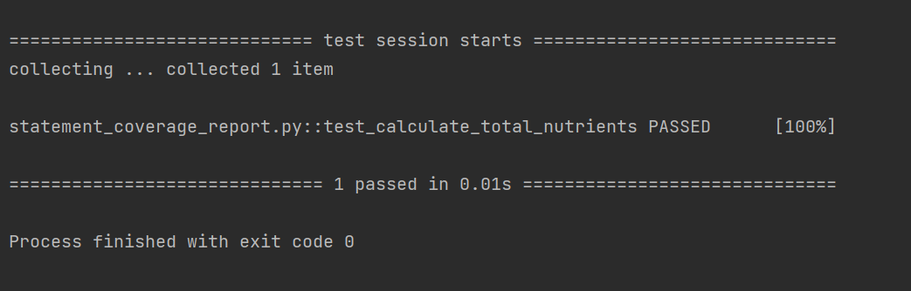
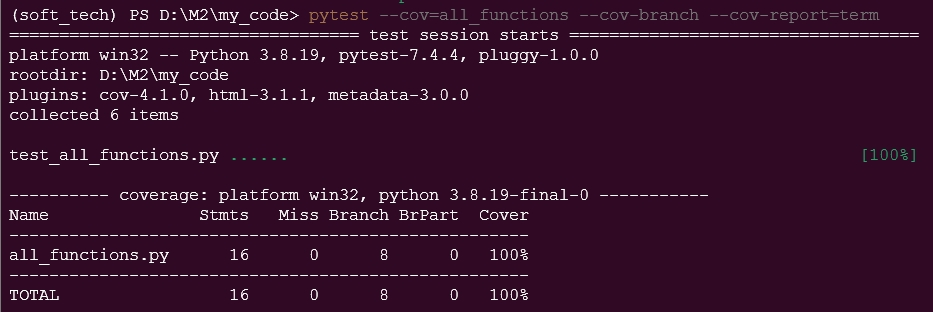

# Coverage Testing Report

Please provide your GitHub repository link.
### GitHub Repository URL: https://github.com/Geoffrey24/Milestone1_Group43

---

The testing report should focus solely on <span style="color:red"> testing all the self-defined functions related to 
the five required features.</span> There is no need to test the GUI components. Therefore, it is essential to decouple your code and separate the logic from the GUI-related code.

You should perform statement coverage testing and branch coverage testing. For each type, provide a description and an analysis explaining how you evaluated the coverage.

## 1. **Test Summary**
list all tested functions related to the five required features:

| **Tested Functions** |  
|----------------------|
| `search_food(food_name)`         | 
| `get_nutrient_breakdown(food_item)`      |
| `filter_by_nutrient_range(min, max)` |
| `categorize_by_nutrient_level(food_list, level)` |
| `calculate_total_nutrients(food_list)` |


---

## 2. **Statement Coverage Test**

### 2.1 Description

The test cases are designed to reach 100% statement coverage as they exercise every line in each function to determine wheter the function meets the coverage report or not. Each test case is directly testing a hard coded function to ensure the projects functions operate as intended. The test cases produce a covergae report to ensure the functions are tested 100% and function as intended.

### 2.2 Testing Results
You can use the following command to run the statement coverage test and generate the report in the terminal. Afterward, include a screenshot of the report. 

You must provide the test_all_functions.py file, which contains all test functions, otherwise pytest will not be able to execute the tests.

```commandline
pytest --cov=all_functionsM2.py --cov-report=term
```
Note: In the command above, the file/module `all_functions` does not include the .py extension. all_functions.py should contain all the tested functions related to the five required features.



## 3. **Branch Coverage Test**

### 3.1 Description

Explain how you designed the test cases (i.e., test_all_functions.py) to reach 100% branch coverage.

### 3.2 Testing Results
You can use the following command to run the branch coverage test and generate the report in the terminal. Afterward, include a screenshot of the report. 

You must provide the test_all_functions.py file, which contains all test functions, otherwise pytest will not be able to execute the tests.

```commandline
pytest --cov=all_functions --cov-branch --cov-report=term
```
Note: In the command above, the file/module `all_functions` does not include the .py extension. all_functions.py should contain all the tested functions related to the five required features.


