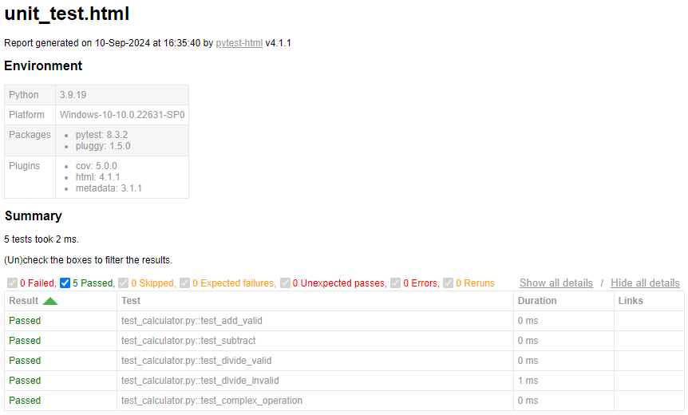

# Unit Testing Report


### GitHub Repository URL: https://github.com/Geoffrey24/Milestone1_Group43

---

The testing report should focus solely on <span style="color:red"> testing all the self-defined functions related to 
the five required features.</span> There is no need to test the GUI components. Therefore, it is essential to decouple your code and separate the logic from the GUI-related code.

**Five self defined functions are:**
1. Food Search 
2. Nutrition Breakdown
3. Nutrition Range Filter
4. Nutrition Level Filter
5. Additional Feature

## 1. **Test Summary**
The table below lists all the self-defined functions corresponding to the five required features of the application and the test functions designed to validate them.

| **Tested Functions** | **Test Functions**                                                                                                                         |
|----------------------|--------------------------------------------------------------------------------------------------------------------------------------------|
| `search_food_item(query)`         | `test_search_food_item_valid()` <br>  `test_search_food_item_invalid()`                                                                    |
| `get_nutrition_breakdown(food)`   | `test_get_nutrition_breakdown_valid()` <br>  `test_get_nutrition_breakdown_invalid()`                                                      |
| `filter_by_nutrient_range(min, max)` | `test_filter_by_nutrient_range_valid()` <br>  `test_filter_by_nutrient_range_invalid()`                                                    |
| `categorize_nutritional_level(nutrient)` | `test_categorize_nutritional_level_low()` <br>  `test_categorize_nutritional_level_mid()`  <br> `test_categorize_nutritional_level_high()` |
| `additional_feature_function()`         | `test_additional_feature_valid()` <br>  `test_additional_feature_invalid()`                                                                  |

---

## 2. **Test Case Details**

### Test Case 1:
- **Test Function/Module**
  - `test_divide_valid()`
  - `test_divide_invalid()`
- **Tested Function/Module**
  - `divide(a, b)`
- **Description**
  - A brief description of the tested function's usage, including its purpose, input, and output.
- **1) Valid Input and Expected Output**  

| **Valid Input**               | **Expected Output** |
|-------------------------------|---------------------|
| `divide(10, 2)`               | `5`                 |
| `divide(10, -2)`              | `-5`                |
| `add more cases in necessary` | `...`               |

- **1) Code for the Test Function**
```python
def test_divide_valid():
    assert divide(10, 2) == 5
    assert divide(10, -2) == -5
```
- **2) Invalid Input and Expected Output**

| **Invalid Input**             | **Expected Output** |
|-------------------------------|---------------------|
| `divide(10, 0)`               | `Handle Exception`  |
| `add more cases in necessary` | `...`               |

- **2) Code for the Test Function**
```python
def test_divide_invalid():
    with pytest.raises(ValueError) as exc_info:
        divide(10, 0)
    assert exc_info.type is ValueError
```
### Test Case 2:
- **Test Function/Module**
  - `test_divide_valid()`
  - `test_divide_invalid()`
- **Tested Function/Module**
  - `divide(a, b)`
- **Description**
  - A brief description of the tested function's usage, including its purpose, input, and output.
- **1) Valid Input and Expected Output**  

| **Valid Input**               | **Expected Output** |
|-------------------------------|---------------------|
| `divide(10, 2)`               | `5`                 |
| `divide(10, -2)`              | `-5`                |
| `add more cases in necessary` | `...`               |

- **1) Code for the Test Function**
```python
def test_divide_valid():
    assert divide(10, 2) == 5
    assert divide(10, -2) == -5
```
- **2) Invalid Input and Expected Output**

| **Invalid Input**             | **Expected Output** |
|-------------------------------|---------------------|
| `divide(10, 0)`               | `Handle Exception`  |
| `add more cases in necessary` | `...`               |

- **2) Code for the Test Function**
```python
def test_divide_invalid():
    with pytest.raises(ValueError) as exc_info:
        divide(10, 0)
    assert exc_info.type is ValueError
```

### Test Case 3:
- **Test Function/Module**
  - `test_divide_valid()`
  - `test_divide_invalid()`
- **Tested Function/Module**
  - `divide(a, b)`
- **Description**
  - A brief description of the tested function's usage, including its purpose, input, and output.
- **1) Valid Input and Expected Output**  

| **Valid Input**               | **Expected Output** |
|-------------------------------|---------------------|
| `divide(10, 2)`               | `5`                 |
| `divide(10, -2)`              | `-5`                |
| `add more cases in necessary` | `...`               |

- **1) Code for the Test Function**
```python
def test_divide_valid():
    assert divide(10, 2) == 5
    assert divide(10, -2) == -5
```
- **2) Invalid Input and Expected Output**

| **Invalid Input**             | **Expected Output** |
|-------------------------------|---------------------|
| `divide(10, 0)`               | `Handle Exception`  |
| `add more cases in necessary` | `...`               |

- **2) Code for the Test Function**
```python
def test_divide_invalid():
    with pytest.raises(ValueError) as exc_info:
        divide(10, 0)
    assert exc_info.type is ValueError
```

### Test Case 4:
- **Test Function/Module**
  - `test_divide_valid()`
  - `test_divide_invalid()`
- **Tested Function/Module**
  - `divide(a, b)`
- **Description**
  - A brief description of the tested function's usage, including its purpose, input, and output.
- **1) Valid Input and Expected Output**  

| **Valid Input**               | **Expected Output** |
|-------------------------------|---------------------|
| `divide(10, 2)`               | `5`                 |
| `divide(10, -2)`              | `-5`                |
| `add more cases in necessary` | `...`               |

- **1) Code for the Test Function**
```python
def test_divide_valid():
    assert divide(10, 2) == 5
    assert divide(10, -2) == -5
```
- **2) Invalid Input and Expected Output**

| **Invalid Input**             | **Expected Output** |
|-------------------------------|---------------------|
| `divide(10, 0)`               | `Handle Exception`  |
| `add more cases in necessary` | `...`               |

- **2) Code for the Test Function**
```python
def test_divide_invalid():
    with pytest.raises(ValueError) as exc_info:
        divide(10, 0)
    assert exc_info.type is ValueError
```


### Test Case 5:
- **Test Function/Module**
  - `test_divide_valid()`
  - `test_divide_invalid()`
- **Tested Function/Module**
  - `divide(a, b)`
- **Description**
  - A brief description of the tested function's usage, including its purpose, input, and output.
- **1) Valid Input and Expected Output**  

| **Valid Input**               | **Expected Output** |
|-------------------------------|---------------------|
| `divide(10, 2)`               | `5`                 |
| `divide(10, -2)`              | `-5`                |
| `add more cases in necessary` | `...`               |

- **1) Code for the Test Function**
```python
def test_divide_valid():
    assert divide(10, 2) == 5
    assert divide(10, -2) == -5
```
- **2) Invalid Input and Expected Output**

| **Invalid Input**             | **Expected Output** |
|-------------------------------|---------------------|
| `divide(10, 0)`               | `Handle Exception`  |
| `add more cases in necessary` | `...`               |

- **2) Code for the Test Function**
```python
def test_divide_invalid():
    with pytest.raises(ValueError) as exc_info:
        divide(10, 0)
    assert exc_info.type is ValueError
```

### Test Case 6:

add more test cases if necessary.

## 3. **Testing Report Summary**
Include a screenshot of unit_test.html showing the results of all the above tests. 

You can use the following command to run the unit tests and generate the unit_test.html report.

```commandline
pytest test_all_functions.py --html=unit_test.html --self-contained-html
```
Note: test_all_functions.py should contain all the test functions designed to test the self-defined functions related 
to the five required features.


