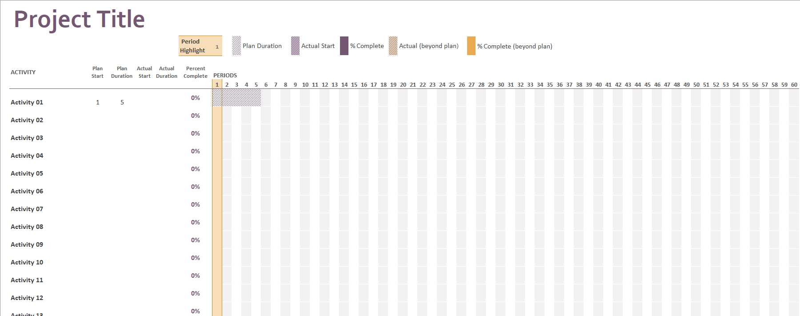

# Project Plan

## Project Name: Food Nutrition
## Group Number: 43

### Team members 

| Student No. | Full Name            | GitHub Username | Contribution (sum to 100%) | 
|-------------|----------------------|--------------|--------------------------------
| s5329877    | Geofrry Karuga       | Geoffrey24   | 50% or Equal               |
| s5404089    | Mohammad Rashed khan | Rashed1808   | 50%or Equal                |

### Brief Description of Contribution

Please Describe what you have accomplished in this group project.
- s5329877, Geofrry Karuga
  - Accomplishments: Done project plan overview
- s5404089, Mohammad khan 
  - Accomplishments: Design documentation and WBS ,GHANT CHAT,WORK ESTIMATION

# Table of Contents

* [Project Plan](#project-plan)
  * [1. Project Overview](#1-project-overview)
    * [1.1 Project Objectives](#11-project-objectives)
    
The primary objective of this project is to design, develop, and implement a desktop application that allows users to analyze and visualize nutritional data from a comprehensive database. The application will feature a user-friendly interface to facilitate the following functionalities:

* Food Search: Users can search for food items and retrieve detailed nutritional information.
* Nutrition Breakdown: Users can visualize the breakdown of nutrients for a selected food item using pie charts and bar graphs.
* Nutrition Range Filter: Users can filter food items based on specified nutritional ranges.
* Nutrition Level Filter: Users can categorize foods based on low, mid, and high nutritional content levels.
* Additional Feature: The team will brainstorm and implement an innovative feature that enhances the application's utility.
    * [1.2 Project Stakeholders](#12-project-stakeholders)
  
1) Project Team:
2) Project Manager
3) Lead Developer
4) UI/UX Designer
5) Data Analyst
6) Quality Assurance Specialist
7) End Users: Individuals seeking nutritional information and dietary analysis tools.
8) Academic Supervisor: Responsible for evaluating the project deliverables and ensuring they meet academic standards.
9) Institution: The university or educational institution that sets the project guidelines and objectives.
    * [1.3 Project Scope](#13-project-scope)
   
The project involves the development of a nutritional data analysis and visualization tool with the following scope:

* In-Scope:

Development of a desktop application with the specified features (Food Search, Nutrition Breakdown, Nutrition Range Filter, Nutrition Level Filter).
Design and implementation of a graphical user interface (GUI).
Data preprocessing and integration of the Nutritional_Food_Database.csv.
Testing and validation of the application for accuracy and usability.
Documentation of the entire development process, including a project plan, design document, and user manual.
* Out-of-Scope:

Mobile application development.
Integration with external APIs or databases beyond the provided CSV file.
Advanced machine learning or predictive analytics features.
Ongoing maintenance or updates post-project completion.

[2. Work Breakdown Structure]

WBS for our project(Work Breakdown Structure) :

1.Project Planning

* 1.1 Project Plan Overview
* 1.2 Project Objectives Documentation
* 1.3 Project Scope Definition
* 1.4 Stakeholder Identification

2.Design

* 2.1 Design Documentation
* 2.2 User Interface (UI) Design
* 2.3 User Experience (UX) Design

3.Data Preprocessing

* 3.1 Nutritional_Food_Database.csv Import
* 3.2 Data Cleaning and Validation
* 3.3 Data Integration

4.Development

* 4.1 Desktop Application Development
* 4.2 Feature Implementation
+ 4.2.1 Food Search
+ 4.2.2 Nutrition Breakdown
+ 4.2.3 Nutrition Range Filter
+ 4.2.4 Nutrition Level Filter
+ 4.2.5 Additional Feature
* 4.3 Graphical User Interface (GUI) Development

5.Testing and Validation
* 5.1 Unit Testing
* 5.2 Integration Testing
* 5.3 User Acceptance Testing (UAT)
* 5.4 Usability Testing 
* 
* Documentation
* 6.1 Project Plan Documentation
* 6.2 Design Documentation
* 6.3 User Manual

7.Project Closure

* 7.1 Final Report
* 7.2 Lessons Learned
* 7.3 Project Evaluation

  * [3. Activity Definition Estimation]
 
Activity Definition and Estimation

3.1 Project Planning

Activity: Develop Project Plan
Description: Define project scope, objectives, and stakeholders
Estimated Duration: 2 days
Resources: Project Manager, Team Leads

Activity: Define Project Scope
Description: Identify in-scope and out-of-scope tasks
Estimated Duration: 2 days
Resources: Project Manager, Team Leads

3.2 Design

Activity: Develop Design Documentation
Description: Create UI/UX design documents
Estimated Duration: 3 days
Resources: UI/UX Designer

Activity: Develop GUI Prototype
Description: Create a clickable GUI prototype
Estimated Duration: 2 days
Resources: UI/UX Designer

3.3 Data Preprocessing

Activity: Import Nutritional Food Database
Description: Import CSV file into application
Estimated Duration: 2 days
Resources: Data Analyst

Activity: Clean and Validate Data
Description: Ensure data accuracy and consistency
Estimated Duration: 3 days
Resources: Data Analyst

3.4 Development

Activity: Develop Desktop Application
Description: Build the desktop application
Estimated Duration: 6 days
Resources: Lead Developer, Development Team

Activity: Implement Features
Description: Implement food search, nutrition breakdown, etc.
Estimated Duration: 5 days
Resources: Lead Developer, Development Team

3.5 Testing and Validation

Activity: Unit Testing
Description: Test individual components
Estimated Duration: 2 days
Resources: QA Specialist

Activity: Integration Testing
Description: Test integrated components
Estimated Duration: 3 days
Resources: QA Specialist

3.6 Documentation

Activity: Develop User Manual
Description: Create user documentation
Estimated Duration: 3 days
Resources: Technical Writer

Activity: Develop Project Report
Description: Document project progress and outcomes
Estimated Duration: 2 days
Resources: Project Manager
  * [4. Gantt Chart]()
[Gantt food NUTRITION .xlsx](..%2F..%2F..%2FDesktop%2FGantt%20food%20NUTRITION%20.xlsx)
[Gantt food NUTRITION .xlsx](..%2F..%2F..%2FDesktop%2FGantt%20food%20NUTRITION%20.xlsx)

## 1. Project Overview

### 1.1 Project Objectives

Establish objectives or goals that the project aims to achieve.

### 1.2 Project Stakeholders

Identify all key stakeholders involved in the project, including internal teams and potential end-users.

### 1.3 Project Scope

Define and manage what is included or excluded in the project and product.

## 2. Work Breakdown Structure

Include the Work Breakdown Structure (WBS) for the entire project. WBS should be presented as a hierarchical diagram. Use the elements from the WBS to define activities in Section 3, and schedule these activities in the Gantt Chart in Section 4. Ensure all project activities are considered and included in the WBS.

![WBS][WBS (FOOD NUTRITION).xlsx](..%2F..%2F..%2FDesktop%2FWBS%20%28FOOD%20NUTRITION%29.xlsx)

## 3. Activity Definition Estimation

Define the activities required for your project based on the WBS, and assign responsibilities to team members. Each activity should be numbered and correspond with your Gantt chart. Provide estimated durations for each activity to facilitate Gantt chart preparation.

| Activity #No | Activity Name | Brief Description           | Duration | Responsible Team Members |
|--------------|--------------|-----------------------------|----------|--------------------------|
| 1            | project plan | planning and documentations | 4        | Geoffrey                 |
| 2            | wbs          | whole work structure        | 3        | mohammad                 |
| 3            | ghant chat   | visual representation       | 2        | mohammad                 |

## 4. Gantt Chart
You have to use the provided Gantt chart template.  

Use the provided Gantt chart template to list all items from the Activity Definition along with relevant estimates 
and scheduling. Ensure that the Gantt chart reflects the activity definitions from Section 3. Track actual start 
times and durations. Besides including Gantt chart here, you should also submit your Gantt chart file separately.

