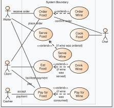
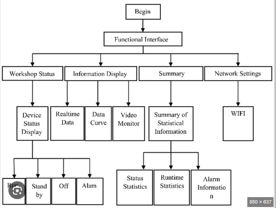

# Software Design Document

## Project Name: Food NUTRITION 
## Group Number: 43

## Team members

| Student Number | Name           | 
|----------------|----------------|
| s5329877       | Geofrry Karuga |
| s5404089       | MOHAMMAD KHAN  | 
| s5293924      |  michael piva 

# Table of Contents

<!-- TOC -->
* [Table of Contents](#table-of-contents)
  * [1. System Vision](#1-system-vision)
    * [1.1 Problem Background](#11-problem-background)
    * [1.2 System capabilities/overview](#12-system-capabilitiesoverview)
    * [1.3	Potential Benefits](#13potential-benefits)
  * [2. Requirements](#2-requirements)
    * [2.1 User Requirements](#21-user-requirements)
    * [2.2	Software Requirements](#22software-requirements)
    * [2.3 Use Case Diagrams](#23-use-case-diagrams)
    * [2.4 Use Cases](#24-use-cases)
  * [3.	Software Design and System Components](#3-software-design-and-system-components-)
    * [3.1	Software Design](#31software-design)
    * [3.2	System Components](#32system-components)
      * [3.2.1 Functions](#321-functions)
      * [3.2.2 Data Structures / Data Sources](#322-data-structures--data-sources)
      * [3.2.3 Detailed Design](#323-detailed-design)
  * [4. User Interface Design](#4-user-interface-design)
    * [4.1 Structural Design](#41-structural-design)
    * [4.2	Visual Design](#42visual-design)
  *[5.* 5.1 unit testing (statement test report and branch coverage report)
    * 5.2 exicutive summary of five feature of our applications 

    * 
<!-- TOC -->
  

## 1. System Vision

### 1.1 Problem Background

- Problem Identification: What problem does this system solve?
 
The system addresses the challenge of accessing, analyzing, and visualizing nutritional data. Currently, users struggle with finding reliable nutritional information, comparing nutritional values across different food items, and understanding complex data in an intuitive way. The application provides a solution that simplifies these tasks, making nutritional information more accessible and actionable.
- Dataset: What is the dataset used?

The system will utilize a comprehensive nutritional database that includes detailed information on various food items, their macronutrient and micronutrient content, daily recommended values, and other relevant data. This dataset may be sourced from public health databases, scientific publications, or custom-built by the development team.
- Data Input/Output: What kind of data input and output is required?

Input: Users will input data through searching for food items within the application, applying filters, and possibly uploading custom food data in formats like CSV.

Output: The system will produce visual representations such as pie charts, bar graphs, and detailed nutritional breakdowns. Users can export these visualizations and data summaries for further analysis or reporting.
- Target Users: Who will use the system, and why?

The primary users include nutritionists, dietitians, fitness enthusiasts, and health-conscious individuals. They will use the system to easily access and analyze nutritional data, enabling them to make informed dietary choices, create meal plans, and educate clients or themselves about nutrition.

### 1.2 System capabilities/overview

- System Functionality: What will the system do?

The system will allow users to search for food items, view detailed nutritional information, visualize nutrient breakdowns, filter foods by specific nutritional ranges, and categorize foods based on nutrient levels.
- Features and Functionalities: Describe the key features and functionalities of the system.

1) Food Search: Users can search for specific food items and retrieve detailed nutritional information.

2) Nutrition Breakdown: Users can visualize the breakdown of nutrients for a selected food item using pie charts and bar graphs.

3) Nutrition Range Filter: Users can filter food items based on specified nutritional ranges (e.g., calories, fat, protein).
4) Nutrition Level Filter: Users can categorize foods based on low, mid, and high nutritional content levels.
5) Additional Feature: The team will brainstorm and implement an innovative feature that enhances the application's utility, such as a meal planning tool or a comparison function between different food items.

### 1.3	Benefit Analysis

How will this system provide value or benefit?

The system will provide value by simplifying the process of nutritional analysis and visualization. It will help users make informed decisions about their diet and health, ultimately contributing to better nutritional education and healthier lifestyles. The user-friendly interface and comprehensive data visualization will make complex nutritional information accessible to a broader audience.

## 2. Requirements

### 2.1 User Requirements

* Detail how users are expected to interact with or use the program:

User Interaction: Users will interact with the system through a graphical user interface (GUI) that allows them to search for food items, apply filters, and generate visual reports. The system must be intuitive, with clear navigation and responsive design.

#### Functionalities from End-User Perspective:

* Narrative Description: Users will search for food items by name, apply filters to refine their search, and view detailed nutritional information in both textual and graphical formats.
* Listing of User Needs:
  
Need 1: The system must allow users to easily search for food items by name or category.

Need 2: The system must provide clear and detailed nutritional information for each food item.

Need 3: The system must offer visualization tools (e.g., pie charts, bar graphs) to help users understand the nutritional content of food items.

Need 4: The system must allow users to filter food items based on nutritional criteria such as calorie range, fat content, etc.

Need 5: The system must enable users to categorize and compare foods based on their nutritional content.

#### Fictional User Persona:
Name: Sarah, a Nutritionist

Role: Sarah is a professional nutritionist who needs to create meal plans for her clients. She uses the application to quickly find nutritional information and visualize the impact of different foods on overall diet quality.

Needs: Sarah needs a reliable and efficient tool to access accurate nutritional data, compare food items, and present this information to her clients in a comprehensible manner.

Usage Scenario: Sarah uses the application to search for specific food items, visualize their nutritional breakdown, and export this information for use in client reports.
### 2.2	Software Requirements
Define the functionality the software will provide. This section should list requirements formally, often using the word "shall" to describe functionalities.

 Functional Requirements:  
- R1.2: The program shall display detailed nutritional information for each selected food item.
- R1.3: The program shall generate visualizations such as pie charts and bar graphs representing the nutritional breakdown of selected food items.
- R1.4: The program shall enable users to filter food items based on nutritional ranges such as calories, fat, protein, etc.
- R1.5: The program shall allow users to categorize and compare food items based on low, mid, and high nutritional content levels.
- R1.6: The program shall allow users to export nutritional information and visualizations in PDF or image format.

### 2.3 Use Case Diagram
Provide a system-level Use Case Diagram illustrating all required features.

Example:  

### 2.4 Use Cases
Include at least 5 use cases, each corresponding to a specific function.

| Use Case ID    | UC-001                |
|----------------|-----------------------|
| Use Case Name  | Search for Food Items |
| Actors         | User                    |
| Description    | he user searches for a food item by entering its name in the search bar.                  |
| Flow of Events |The user enters a food item name in the search bar also The system retrieves and displays a list of matching food items.
| Alternate Flow | If no matching food items are found, the system notifies the user and suggests related items.                  |

| Use Case ID    | UC-002                                                              |
|----------------|---------------------------------------------------------------------|
| Use Case Name  | Visualize Nutrition Breakdown                                       |
| Actors         | User                                                                |
| Description    | The user visualizes the nutrient breakdown of a selected food item. |
| Flow of Events | The user selects a food item from the search results. The system displays a pie chart and bar graph representing the nutritional content of the food item.              |
| Alternate Flow | If the food item lacks complete nutritional data, the system provides a warning and displays available data.                                                                |

| Use Case ID    | UC-003                                                                                                                                                                                                        |
|----------------|---------------------------------------------------------------------------------------------------------------------------------------------------------------------------------------------------------------|
| Use Case Name  | Apply Nutrition Range Filter                                                                                                                                                                                  |
| Actors         | User                                                                                                                                                                                                          |
| Description    | The user applies a filter to find foods within a specific nutritional range                                                                                                                                   |
| Flow of Events | The user selects the "Filter" option, The user specifies the desired nutritional range (e.g., calories between 100-200), The system filters the list of food items and displays those that meet the criteria. |
| Alternate Flow | If no food items meet the criteria, the system suggests adjusting the filter settings.                                                                                                                                                                                                          |

| Use Case ID    | UC-004                                                                                                                                                                                                |
|----------------|-------------------------------------------------------------------------------------------------------------------------------------------------------------------------------------------------------|
| Use Case Name  | Categorize Foods by Nutrition Level                                                                                                                                                                   |
| Actors         | User                                                                                                                                                                                                  |
| Description    | The user categorizes foods into low, mid, and high nutritional content levels.                                                                                                                        |
| Flow of Events | The user selects the "Categorize" option, The system categorizes food items based on predefined nutritional thresholds, The categorized foods are displayed in separate sections for easy comparison. |
| Alternate Flow | If a food item does not fit into any category, the system provides a custom category.                                                                                                                                                                                                  |

| Use Case ID    | UC-005                                                                                                                                                 |
|----------------|--------------------------------------------------------------------------------------------------------------------------------------------------------|
| Use Case Name  | Export Nutritional Data                                                                                                                                |
| Actors         | User                                                                                                                                                   |
| Description    | The user exports the nutritional data and visualizations for a selected food item.                                                                     
| Flow of Events | The user selects the "Export" option, The user chooses the export format (e.g., PDF, PNG), The system generates the file and provides a download link. |
| Alternate Flow | If there is an issue with generating the file, the system notifies the user and suggests troubleshooting steps                                                                                                                                                   |

## 3.	Software Design and System Components 

### 3.1	Software Design
Include a flowchart that illustrates how your software will operate.
FLOWCHART PROVIDED:

Example:  
sign_flowchart.png)

[flowchart software development.xlsx](..%2F..%2F..%2FDesktop%2Fflowchart%20software%20development.xlsx)
### 3.2	System Components

#### 3.2.1 Functions
List all key functions within the software. For each function, provide:
- Description: Brief explanation of the function’s purpose.
- Input Parameters: List parameters, their data types, and their use.
- Return Value: Describe what the function returns.
- Side Effects: Note any side effects, such as changes to global variables or data passed by reference.

Function 1: searchFoodItem
Description: Searches for food items based on user input and retrieves relevant data.
Input Parameters:
query (String): The name or partial name of the food item to search for.

Return Value:
results (List of Dictionaries): A list where each dictionary contains details about a food item matching the query.
Side Effects:
May update the global search results cache.
No changes to external data sources.

Function 2: generateNutritionBreakdown
Description: Creates visual representations (pie charts, bar graphs) of the nutritional content of a selected food item.
Input Parameters:
foodItemID (Integer): Identifier for the selected food item.

Return Value:
visualizations (Dictionary): Contains image data or file paths for the generated visualizations.
Side Effects:
May update the global visualizations cache.
Possible temporary file creation for images.

Function 3: applyNutritionRangeFilter
Description: Filters food items based on specified nutritional criteria, such as calorie range or fat content.
Input Parameters:
criteria (Dictionary): Contains keys and values for the nutritional ranges to filter (e.g., {"calories": [100, 200]}).

Return Value:
filteredItems (List of Dictionaries): A list of food items that match the specified criteria.
Side Effects:
May modify the global list of displayed food items.
No changes to external data sources.

Function 4: categorizeFoodsByNutritionalLevel
Description: Categorizes food items into low, mid, or high nutritional content levels based on predefined thresholds.
Input Parameters:
thresholds (Dictionary): Contains thresholds for categorization (e.g., {"low": 10, "mid": 20}).

Return Value:
categorizedItems (Dictionary): Contains lists of food items categorized into low, mid, and high levels.
Side Effects:
May update the global categorized food items cache.
No changes to external data sources.

Function 5: exportNutritionalData
Description: Exports nutritional data and visualizations in specified formats (e.g., PDF, PNG).
Input Parameters:
data (Dictionary): Nutritional data and visualizations to be exported.
format (String): Desired export format (e.g., "PDF", "PNG").

Return Value:
filePath (String): Path to the generated export file.
Side Effects:
May create temporary files or modify global file paths.
Possible impact on disk space.

#### 3.2.2 Data Structures / Data Sources
List all data structures or sources used in the software. For each, provide:

- Type: Type of data structure (e.g., list, set, dictionary).
- Usage: Describe where and how it is used.
- Functions: List functions that utilize this structure.

Data Structure 1: foodItemsList
Type: List of Dictionaries
Usage: Stores the data for all food items available in the system.

Functions:
searchFoodItem
applyNutritionRangeFilter
categorizeFoodsByNutritionalLevel

Data Structure 2: nutritionalDataCache
Type: Dictionary
Usage: Caches the nutritional data and visualizations for recently accessed food items.

Functions:
generateNutritionBreakdown
exportNutritionalData

Data Structure 3: exportFormats
Type: List
Usage: Lists the available formats for exporting data (e.g., PDF, PNG).

Functions:
exportNutritionalData

#### 3.2.3 Detailed Design
Detailed Hierachy chart provided

[flowchart soft[hierachy chart user interface.xlsx](..%2F..%2F..%2FDesktop%2Fhierachy%20chart%20user%20interface.xlsx)ware development.xlsx](..%2F..%2F..%2FDesktop%2Fflowchart%20software%20development.xlsx)
[flowchart software development.xlsx](..%2F..%2F..%2FDesktop%2Fflowchart%20software%20development.xlsx)

Pseudocode for exportNutritionalData
function exportNutritionalData(data, format):
    filePath = generateFilePath(format)
    if format == "PDF":
        saveAsPDF(filePath, data)
    else if format == "PNG":
        saveAsPNG(filePath, data)
    return filePath

function generateFilePath(format):
    return "export_" + currentTime() + "." + format.lower()

or searchFoodItem
function searchFoodItem(query):
    results = []
    for item in foodItemsList:
        if query in item.name:
            results.append(item)
    return results

## 4. User Interface Design

### 4.1 Structural Design
[hierachy chart user interface.xlsx](..%2F..%2F..%2FDesktop%2Fhierachy%20chart%20user%20interface.xlsx)

Structure: The software will be structured around a main dashboard, with distinct sections for searching, viewing, filtering, and exporting nutritional data. The primary interface components include a search bar, filters, visualizations, and export options.

Information Grouping:

Search Section: Allows users to search for food items.
Nutrition Details Section: Displays detailed nutritional information and visualizations.
Filter Section: Enables users to apply nutritional range filters.
Export Section: Provides options for exporting data and visualizations.
Navigation:

Main Menu: Provides links to Search, Filters, Visualization, and Export sections.
Search Results: Allows users to select food items to view detailed information.
Filter Options: Allows users to refine search results based on nutritional criteria.
Export Options: Provides tools for exporting data in various formats.
Design Choices:

Modular Design: Separates different functionalities into distinct sections to enhance usability and clarity.
Intuitive Navigation: Ensures users can easily access different parts of the application through a simple and consistent menu structure.
Data Visualization: Uses charts and graphs to make complex nutritional information more comprehensible.
Responsive Design: Ensures the interface is accessible and usable across different devices and screen sizes.

### 4.2	Visual Design
Include all wireframes or mock-ups of the interface. Provide a discussion, explanation, and justification for your design choices. Hand-drawn wireframes are acceptable.

- Interface Components: Clearly label all components.
- Screens/Menus: Provide wireframes for different screens, menus, and options.
- Design Details: Focus on the layout and size of components; color and graphics are not required. 

Example:  

screenshot provided :

1.Main Dashboard
Components:

Search Bar: For users to input food item names or keywords. Includes a search button.
Main Menu:
Search: Link to the search functionality.
Filters: Link to filter options.
Visualizations: Link to view nutritional breakdowns.
Export: Link to export data and visualizations.
Recent Searches/Popular Items: Section to display recent searches or popular food items for quick access.
Navigation Bar: At the top for consistent access to main functionalities.

Design Justification:
Search Bar: Positioned prominently to facilitate quick and easy searches.
Main Menu: Provides easy access to the primary functionalities, enhancing navigation efficiency.
Recent Searches/Popular Items: Helps users quickly find frequently used or popular food items, improving usability.

2.Search Results

Components:

Search Results List: Displays food items matching the search query. Each item shows a brief nutritional summary.
Item Details Button: Allows users to view detailed information about a selected food item.
Pagination Controls: For navigating through multiple pages of search results.
Filter Options: Quick access to apply or adjust filters to refine search results.

Design Justification:
Search Results List: Provides a clear overview of food items with essential details for quick selection.
Item Details Button: Facilitates deeper exploration of each item’s nutritional information.
Pagination Controls: Ensures that users can navigate through extensive lists without overwhelming the interface.

3.Nutrition Details
Components:

Food Item Information: Detailed view of the selected food item's nutritional content.
Visualizations:
Pie Chart: Shows the breakdown of macronutrients.
Bar Graph: Displays detailed micronutrient content.
Export Options: Button to export the nutritional data and visualizations.
Back Button: Returns users to the previous screen.

Design Justification:

Detailed View: Provides comprehensive nutritional information for informed decision-making.
Visualizations: Helps users quickly understand the nutritional composition through graphs.
Export Options: Allows users to save and share data, enhancing the application's utility.

4.Filters

Components:

Filter Criteria: Sections to set nutritional ranges (e.g., calories, fat, protein).
Apply Filters Button: Applies selected filters to the search results.
Clear Filters Button: Resets all filters to default values.
Preview of Filtered Results: Displays a brief view of items that match the current filter criteria.

Design Justification:

Filter Criteria: Organized into clearly defined sections to allow precise filtering based on various nutritional parameters.
Apply/Reset Buttons: Provides users with control over their filtering preferences, enhancing flexibility.
Preview of Filtered Results: Offers a quick look at the filtered results to verify filter effectiveness. 

5.Export
Components:
Export Options: Allows users to select the format (PDF, PNG) for data export.
Export Data Button: Initiates the export process.
Export Status: Displays the status of the export operation (e.g., success, error).
Download Link: Provides a link to download the exported file.

Design Justification:

Export Options: Gives users the ability to choose their preferred format for data export.
Export Status: Keeps users informed about the progress and outcome of their export request.
Download Link: Provides easy access to the exported file, facilitating further use or sharing.

Design Details and Justification
Layout and Size:

Consistency: The layout is designed to be consistent across screens to provide a familiar user experience.
Accessibility: Key components like the search bar and filter options are placed at prominent locations for easy access.
Information Grouping: Information is grouped logically (e.g., search results, filters, detailed views) to streamline user interaction and reduce cognitive load.
Color and Graphics:

Although color and graphics are not included in the wireframes, the design emphasizes functionality and usability. Color and graphical elements should be chosen to enhance readability and user engagement.
Navigation:

Main Menu: Provides straightforward access to core functionalities from any screen.
Buttons and Links: Clearly labeled and placed for intuitive navigation and interaction.
User Interaction:

Buttons and Controls: Designed to be easily identifiable and responsive to user actions.
Feedback Mechanisms: Include status messages and visual indicators to guide users and inform them of system actions and responses.
The design choices aim to create a user-friendly interface that is both functional and efficient, ensuring users can easily access, analyze, and export nutritional information.

* 5.1 unit testing (statement test report and branch coverage report)

    * 5.2 exicutive summary of five feature of our applications

    statement coverage report 
    

    * branch cov
    

    
<!-- TOC -->5.1 

